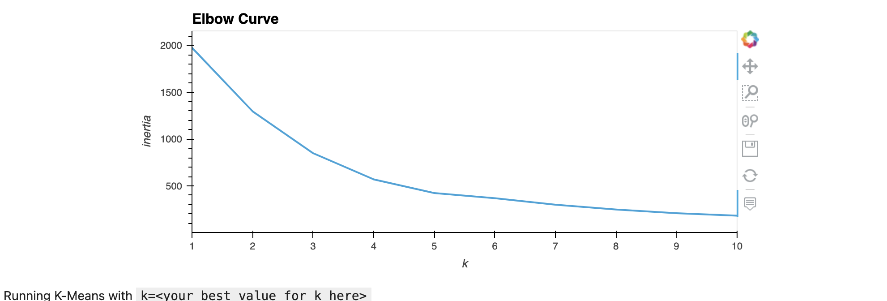
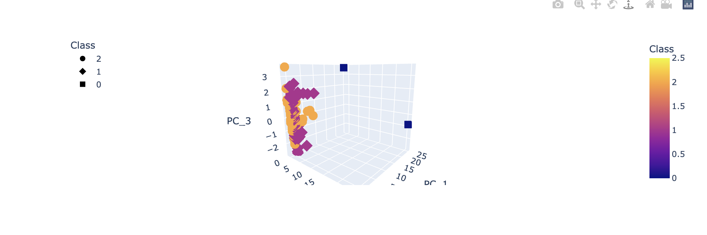

# The Power of the Cloud and Unsupervised Learning

This project aims to analyze cryptocurrencies and group them using classification. 

#### Clustering Cryptocurrencies Using K-Means

```{python}
nertia = []
k = list(range(1, 11))

# Calculate the inertia for the range of k values
for i in k:
    km = KMeans(n_clusters=i, random_state=0)
    km.fit(pcs_df)
    inertia.append(km.inertia_)

# Create the Elbow Curve using hvPlot
elbow_data = {"k": k, "inertia": inertia}
df_elbow = pd.DataFrame(elbow_data)
df_elbow.hvplot.line(x="k", y="inertia", xticks=k, title="Elbow Curve")

```


#### Visualizing Results

3D scatter plot of PCA Data

```{python}
fig = px.scatter_3d(
    clustered_data,
    x="PC_1",
    y="PC_1",
    z="PC_3",
    color="Class",
    symbol="Class",
    width=800,
    hover_name="CoinName",
    hover_data=["Algorithm"]
)
fig.update_layout(legend=dict(x=0, y=1))
fig.show()
```


